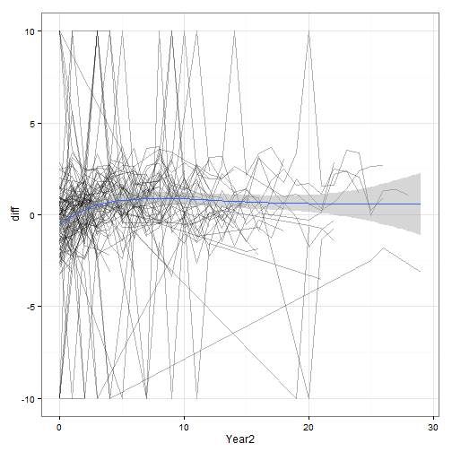

```r
setwd("C:/Users/bleb/Dropbox/cfbFootball")
# load data
load(paste0(getwd(), 'Data/Analysis/coachAbility.rda'))
```

```
## Warning in readChar(con, 5L, useBytes = TRUE): cannot open compressed file
## 'C:/Users/bleb/Dropbox/cfbFootballData/Analysis/coachAbility.rda',
## probable reason 'No such file or directory'
```

```
## Error in readChar(con, 5L, useBytes = TRUE): cannot open the connection
```

```r
# plot 
library(ggplot2)
g <- ggplot(coachAbility, aes(x = Year2, y = diff)) + theme_bw()
g + geom_line(aes(group = coach), alpha = .1) + geom_smooth()
```

```
## geom_smooth: method="auto" and size of largest group is >=1000, so using gam with formula: y ~ s(x, bs = "cs"). Use 'method = x' to change the smoothing method.
```

 


```r
# LMM to coach ability data
library(lme4)
simp.mod <- lmer(diff ~ 1 + Year2 + (1 + Year2|coach), data = coachAbility)
summary(simp.mod)
```

```
## Linear mixed model fit by REML ['lmerMod']
## Formula: diff ~ 1 + Year2 + (1 + Year2 | coach)
##    Data: coachAbility
## 
## REML criterion at convergence: 37400
## 
## Scaled residuals: 
##     Min      1Q  Median      3Q     Max 
## -4.3426 -0.2573  0.0345  0.3091  5.2236 
## 
## Random effects:
##  Groups   Name        Variance Std.Dev. Corr 
##  coach    (Intercept) 6.23172  2.496         
##           Year2       0.02959  0.172    -0.75
##  Residual             8.60942  2.934         
## Number of obs: 7144, groups:  coach, 1230
## 
## Fixed effects:
##             Estimate Std. Error t value
## (Intercept) -0.90593    0.08995 -10.072
## Year2        0.03835    0.01050   3.654
## 
## Correlation of Fixed Effects:
##       (Intr)
## Year2 -0.606
```

```r
quad.mod <- lmer(diff ~ 1 + Year2 + I(Year2^2) + (1 + Year2|coach), data = coachAbility)
summary(quad.mod)
```

```
## Linear mixed model fit by REML ['lmerMod']
## Formula: diff ~ 1 + Year2 + I(Year2^2) + (1 + Year2 | coach)
##    Data: coachAbility
## 
## REML criterion at convergence: 37385.5
## 
## Scaled residuals: 
##     Min      1Q  Median      3Q     Max 
## -4.2845 -0.2490  0.0347  0.3052  5.2127 
## 
## Random effects:
##  Groups   Name        Variance Std.Dev. Corr 
##  coach    (Intercept) 6.0564   2.4610        
##           Year2       0.0334   0.1827   -0.72
##  Residual             8.5561   2.9251        
## Number of obs: 7144, groups:  coach, 1230
## 
## Fixed effects:
##               Estimate Std. Error t value
## (Intercept) -1.0349968  0.0927419 -11.160
## Year2        0.1136885  0.0180473   6.299
## I(Year2^2)  -0.0047014  0.0008837  -5.320
## 
## Correlation of Fixed Effects:
##            (Intr) Year2 
## Year2      -0.568       
## I(Year2^2)  0.274 -0.793
```


```
## Warning in file(file, "rt"): cannot open file
## 'C:/Users/bleb/Dropbox/cfbFootball/Paper/Data/rankings.csv': No such file
## or directory
```

```
## Error in file(file, "rt"): cannot open the connection
```

```
## Error in match(x, table, nomatch = 0L): object 'Period' not found
```

```
## Error in setnames(rankings, "All-Time", "alltime"): Items of 'old' not found in column names: All-Time
```

```
## Error: Unknown variables: year.
```

```
## Error in array(x, c(length(x), 1L), if (!is.null(names(x))) list(names(x), : 'data' must be of a vector type, was 'NULL'
```

```
## Error in array(x, c(length(x), 1L), if (!is.null(names(x))) list(names(x), : 'data' must be of a vector type, was 'NULL'
```

```
## Error in array(x, c(length(x), 1L), if (!is.null(names(x))) list(names(x), : 'data' must be of a vector type, was 'NULL'
```

```
## Error in array(x, c(length(x), 1L), if (!is.null(names(x))) list(names(x), : 'data' must be of a vector type, was 'NULL'
```


```r
# conditional model
cond.mod <- lmer(diff ~ 1 + Year2 + ovrWinmc + Year2:ovrWinmc + 
                   alltimemc + Year2:alltimemc + numAA + Year2:numAA + 
                   numGamesmc + numGamesmc:Year2 + power5conf + Year2:power5conf +
                   (1 + Year2|coach), data = coachAbility)
```

```
## Error in eval(expr, envir, enclos): object 'numAA' not found
```


```r
# subsetting for current coaches only
fb13 <- fb %>%
  filter(Year == 2013) %>%
  ungroup() %>%
  dplyr::select(coach)

coachAbility13 <- subset(coachAbility, coach %in% fb13$coach)

# spaghetti plot for these coaches
library(ggplot2)
g <- ggplot(coachAbility13, aes(x = Year2, y = diff)) + theme_bw()
g + geom_line(aes(group = coach), alpha = .3) + geom_smooth()
```

```
## geom_smooth: method="auto" and size of largest group is <1000, so using loess. Use 'method = x' to change the smoothing method.
```

 


```r
# conditional model
cond.mod.13 <- lmer(diff ~ 1 + Year2 + I(Year2^2) + ovrWinmc + Year2:ovrWinmc + 
                      last10mc + Year2:last10mc + numAA + Year2:numAA + 
                      numGamesmc + numGamesmc:Year2 + power5conf + Year2:power5conf +
                      (1 + Year2|coach), data = coachAbility13)
```

```
## Error in eval(expr, envir, enclos): object 'numAA' not found
```

